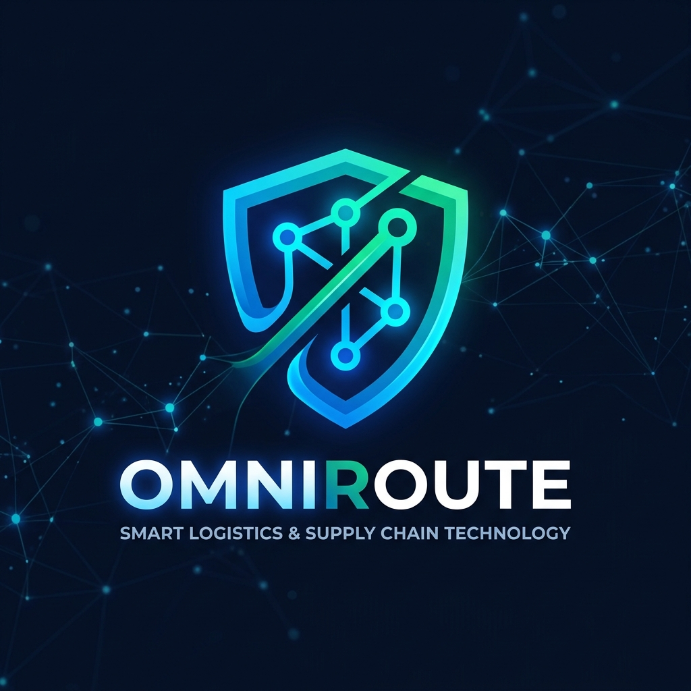

<div align="center">
  

  # 🚀 OmniRoute Sentinel
  **AI-Verified Supply Chain Defense & Real-Time Logistics Control Tower**
  
  [](https://nextjs.org/)
  [](https://turbo.build/)
  [](https://socket.io/)
  [](https://www.typescriptlang.org/)
</div>

<br/>

## 🌐 Live Demos
* 🎛️ **Admin Control Tower:** https://omniroute-sentinel-admin-dashboard-nine.vercel.app/
* 🚛 **Driver Execution Portal:** https://omniroute-sentinel-driver-app.vercel.app/

*(Note: The WebSocket server is running invisibly in the background on Render to sync these two applications in real-time.)*

## 🌟 The Vision

**OmniRoute Sentinel** transforms traditional, reactive supply chains into **proactive decision engines**. 

Instead of waiting for a delay to happen, our system leverages a preemptive disruption detection pipeline to **predict threats early** and immediately orchestrate safe, optimized route diversions before shipments are impacted.

## 🏆 Why It Wins
- **Real-Time Synergy**: A centralized control tower and live driver portals seamlessly communicating via WebSockets.
- **Preemptive AI Routing**: Switches from traditional "reactive" rerouting to "proactive" AI-verified threat avoidance.
- **Production-Ready Architecture**: Built on a highly scalable Turborepo structure.

---

## 🏗️ Architecture & Apps

This project uses a modern **Turborepo** monorepo structure containing three synchronized microservices:

### 1. 🎛️ Admin Dashboard (The Control Tower)
A stunning, high-performance command center for fleet managers.
- **Live Fleet Tracking:** See all vehicles map their coordinates in real-time.
- **One-Click Dispatch:** Send new trucks to specific cities instantly.
- **Dynamic Override:** Intervene and reroute shipments based on live external threat intel.

### 2. 🚛 Driver App (The Execution Layer)
A minimal, map-focused UI explicitly designed for on-the-road execution.
- **Live Telemetry:** Streams real-time GPS coordinates directly to the Control Tower.
- **Instant Updates:** AI rerouting overrides immediately ping the driver's interface over WebSockets.

### 3. 🔌 WebSocket Server (The Bridge)
A low-latency event broker ensuring sub-second syncs between the Control Tower and all active Driver interfaces.

---

## 🛠️ Tech Stack

- **Frameworks:** Next.js (App Router), React 19
- **Monorepo:** Turborepo
- **Real-Time Engine:** Socket.io, Express
- **State Management:** Zustand
- **Styling:** Tailwind CSS, Radix UI (shadcn/ui)
- **Mapping:** Leaflet & React-Leaflet

---

## 🚀 Quick Start (For Collaborators)

Getting the entire ecosystem up and running is as simple as one click!

### Option 1: The One-Click Script (Windows)
1. Open the `scripts/` folder.
2. Double-click `start.bat`.
*This will safely navigate to the root, install all monorepo dependencies, and spin up the Socket Server, Admin Dashboard, and Driver App in parallel.*

### Option 2: Manual Terminal Startup
```bash
# 1. Clone the repository
git clone https://github.com/YOUR_USERNAME/omniroute-sentinel.git
cd omniroute-sentinel

# 2. Install dependencies
npm install

# 3. Ignite the Turborepo engine
npm run dev
```

### 🌐 Accessing the Portals
Once the dev server is running, open these in your browser:
- **Admin Dashboard:** [http://localhost:3000](http://localhost:3000)
- **Driver Portal:** [http://localhost:3001](http://localhost:3001) *(Type any vehicle ID to start driving!)*
- **Socket Broker:** Running silently on port `4000`.

---
<div align="center">
  <i>Built with ⚡ during the Google Hackathon.</i>
</div>